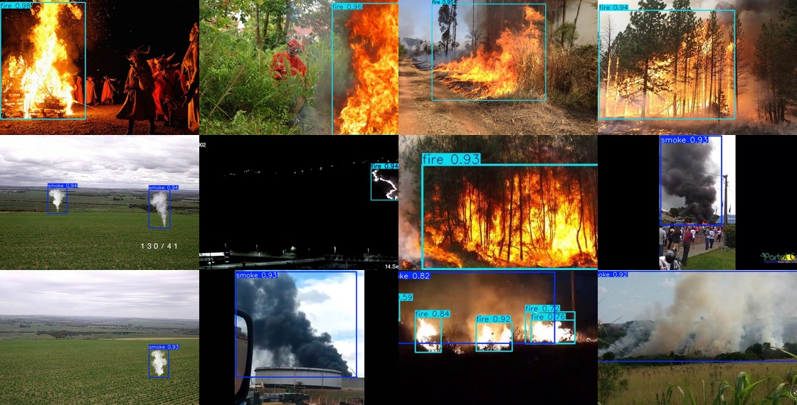
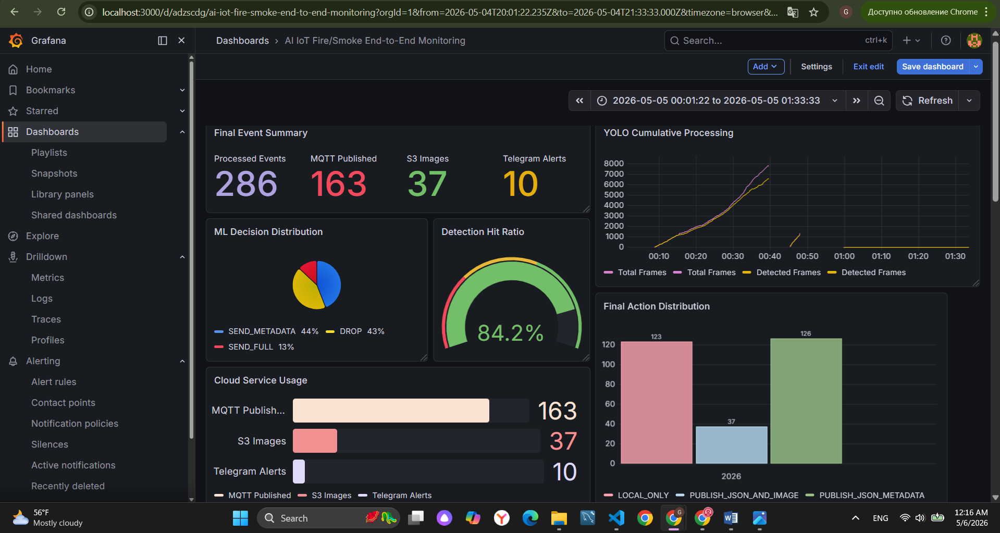

# AI-Powered IoT Fire & Smoke Detection System

An end-to-end AI-driven IoT video analytics system for fire and smoke detection. The project combines computer vision, machine learning, cloud integration, infrastructure automation, and monitoring to intelligently process video streams and manage data transmission.

## Key Features

* Fire and smoke detection using YOLOv8s
* Event-level feature engineering from video streams
* XGBoost-based decision engine
* Intelligent transmission actions:
  - DROP
  - SEND_METADATA
  - SEND_FULL
* MQTT communication through AWS IoT Core
* Amazon S3 integration for image storage
* Telegram alert notifications
* Dockerized deployment
* Infrastructure provisioning with Terraform
* Prometheus and Grafana monitoring

## Architecture

Hybrid Edge–Cloud architecture:

Video Stream → YOLOv8s Detection → Feature Extraction → XGBoost Decision Engine → QoS Assignment → AWS IoT Core → Amazon S3 / Telegram Alerts

## Technology Stack

* Python
* YOLOv8s
* XGBoost
* OpenCV
* MySQL
* MQTT
* AWS IoT Core
* Amazon S3
* Docker & Docker Compose
* Terraform
* Prometheus
* Grafana

## Model Results

### YOLO Comparison

| Model   | Precision | Recall | mAP50 |
| ------- | --------- | ------ | ----- |
| YOLOv8n | 0.621     | 0.564  | 0.604 |
| YOLOv8s | 0.658     | 0.569  | 0.626 |
| YOLO11n | 0.617     | 0.553  | 0.591 |

YOLOv8s selected as the final detection model.

Dataset generation results:
- 11 processed videos
- 7,909 saved frames
- 42,221 detections
- 286 event-level windows

Decision engine:
- XGBoost accuracy: 85%
- Actions: DROP, SEND_METADATA, SEND_FULL

## Detection Example


## Monitoring

The system includes Prometheus metrics collection and Grafana dashboards for:

* Video processing performance
* Detection statistics
* ML decision distribution
* Cloud transmission monitoring
* CPU and memory utilization

## Monitoring Dashboard



## Repository Structure

```text
video_pipeline/   # Detection, ML and cloud pipeline
monitoring/       # Prometheus and Grafana
terraform/        # AWS infrastructure provisioning
results/          # YOLO training and evaluation results
```


